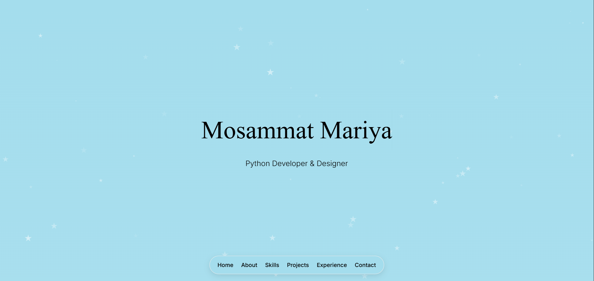

# Portfolio
## Live Demo

Check out the live version of my portfolio here: [Mosammat Mariya Portfolio](https://mosammatmariya.github.io/Portfolio/)

# Personal Portfolio Website

## Overview

A modern, responsive personal portfolio website for Mosammat Mariya — Python Developer & Designer. It showcases skills, projects, experience, and contact information with a clean, minimalist design and smooth animations.

## Features

- **Responsive Design**: Works across mobile, tablet, and desktop
- **Particle.js Background**: Interactive hero background animation
- **Smooth Scroll**: Seamless navigation between sections
- **Form Validation**: Contact form with validation and submission feedback
- **Modal Feedback**: Success/error states for form submission
- **Animated Elements**: Subtle animations to enhance UX
- **Accessibility**: ARIA roles and keyboard-friendly interactions

## Sections

1. **Home**: Name reveal and role subtitle (Python Developer & Designer)
2. **About**: Background, CV download and view
3. **Skills**: Web technologies, programming languages, Python stack, databases, tools, soft skills
4. **Publications**: IEEE publication (present, currently hidden in UI)
5. **Projects**: Key academic/research projects
6. **Experience**: Professional roles and highlights
7. **Contact**: Email, location, social links, and form

## Technologies Used

- HTML5
- CSS3 (custom variables and animations)
- JavaScript (vanilla)
- Particles.js for background animation
- Font Awesome for icons
- FormSubmit for handling form submissions

## Browser Compatibility

Tested and working on:
- Chrome
- Edge

## Credits

- Particles.js for the interactive background
- Font Awesome for the icons
- FormSubmit for handling form submissions
